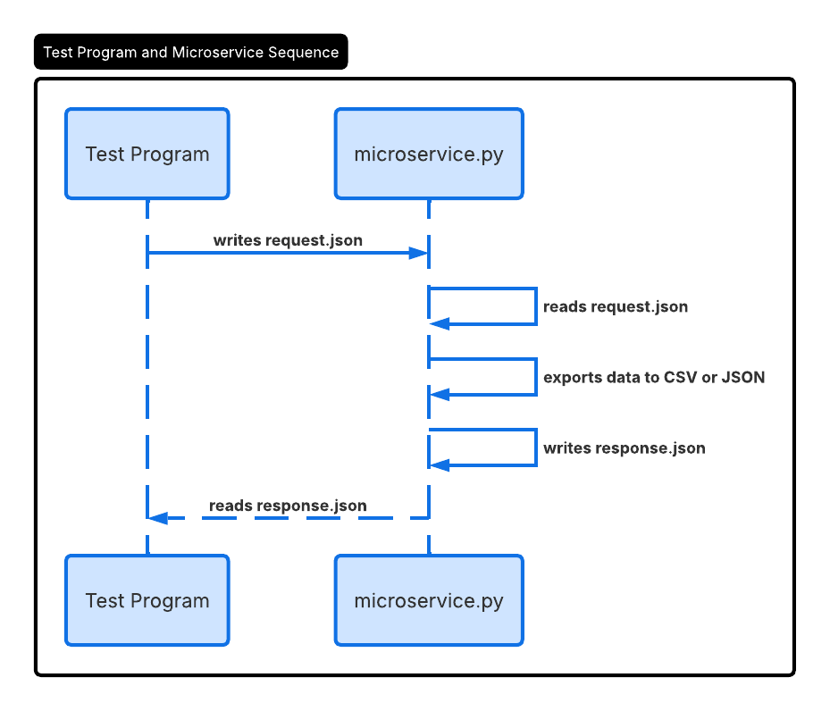

# Data Export Microservice

## What it does
This microservice takes a list of data and saves it as a [CSV](https://en.wikipedia.org/wiki/Comma-separated_values) 
or [JSON](https://www.json.org/json-en.html) file. It communicates using a 
[pipe-based](https://en.wikipedia.org/wiki/Pipeline_(software)) file system: you write a request 
file, it processes it, and writes back a response file.

## How to run it
Make sure [Python](https://www.python.org/downloads/) is installed. Then run:

    python microservice.py

The microservice will start and wait for requests. Leave it running in the background while your 
main program sends requests to it.

## How to request data

Create a file called `request.json` in the same folder as the microservice. Here's what it should 
look like:

    {
        "format": "csv",
        "output_path": "my_export.csv",
        "data": [
            {"ticker": "AAPL", "shares": 10, "price": 189.50},
            {"ticker": "TSLA", "shares": 5,  "price": 245.00}
        ]
    }

**Field breakdown:**
- `format`: the file type you want exported. Must be either `"csv"` or `"json"`. Any other value 
  will return an error.
- `output_path`: the file path where the exported file will be saved (e.g. `"my_export.csv"` or 
  `"exports/portfolio.json"`). The file will be created automatically if it doesn't exist.
- `data`: the list of records to export. Each record is a [dictionary](https://docs.python.org/3/tutorial/datastructures.html#dictionaries) 
  with whatever fields you want, it doesn't have to be stock data.

**Example code to send a request:**

    import json

    # Build the request as a Python dictionary
    request = {
        "format": "csv",
        "output_path": "my_export.csv",
        "data": [
            {"ticker": "AAPL", "shares": 10, "price": 189.50},
            {"ticker": "TSLA", "shares": 5,  "price": 245.00}
        ]
    }

    # Write it to request.json so the microservice can pick it up
    with open("request.json", "w") as f:
        json.dump(request, f)

## How to receive data

After the microservice processes your request, it creates a file called `response.json` in the same 
folder. Your program should wait for that file to appear and then read it.

**Example code to receive a response:**

    import json, time, os

    # Keep checking every 0.1 seconds until response.json exists.
    # This is called polling, we wait instead of assuming it's instant.
    while not os.path.exists("response.json"):
        time.sleep(0.1)

    # Once the file exists, open and read it
    with open("response.json", "r") as f:
        response = json.load(f)

    print(response)

**Possible responses:**

On success:

    {"status": "success", "output_path": "my_export.csv"}

- `status`: confirms the export worked
- `output_path`: the path where the exported file was saved

On failure:

    {"status": "error", "message": "Missing required fields"}

- `status`: indicates something went wrong
- `message`: describes what the problem was. Common errors include missing fields, an unsupported 
  format value, or an invalid path.

## UML Sequence Diagram

